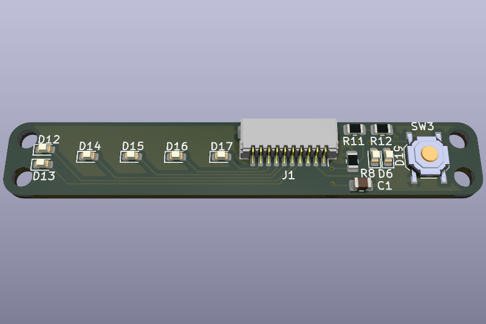
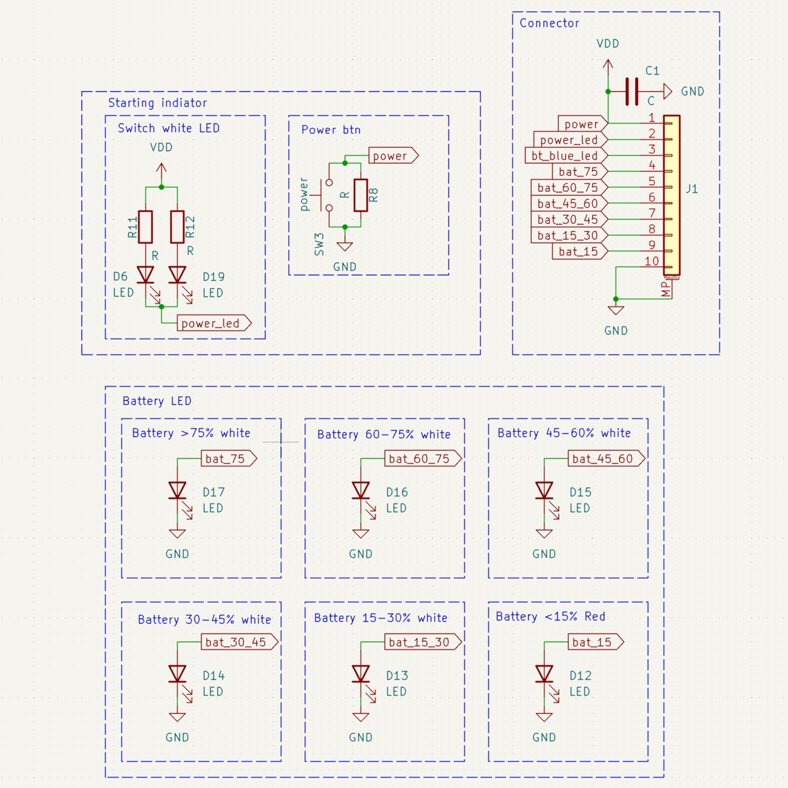
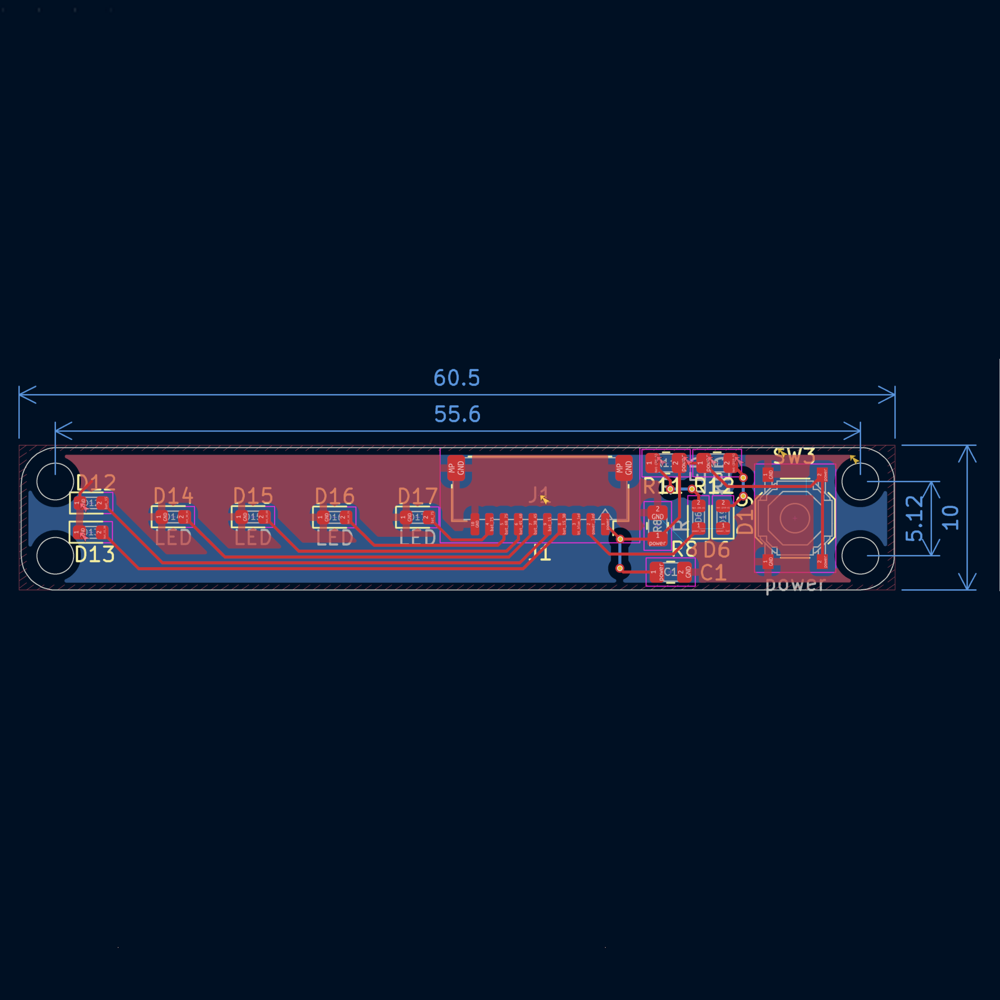
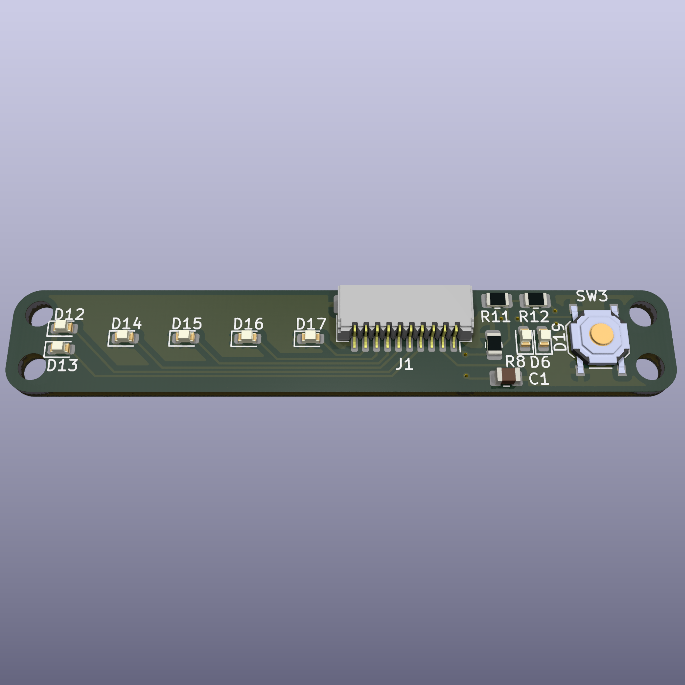

# BatteryLevelIndicator

## 🚀 Overview

The **Battery Level Indicator** is an open-source project designed to visually display the charge level of a battery using **five green LEDs** and a **sixth red LED** for critical low levels. The board also features an **ON/OFF button** that activates the system, illuminating **two white LEDs** when turned on and **two blue LEDs** at other times.

## 🎯 Purpose
- 🔋 **Battery Monitoring**: Provides an intuitive LED-based display of battery charge levels.
- 🔘 **Power Control**: Includes an ON/OFF switch for system activation.
- 🌟 **User-Friendly**: Simple and effective visual indicators for battery status.
- 🛠️ **Open-source & Customizable**: Modify and adapt for various battery-powered projects.

## 📝 Features
| 🏷️ Feature        | 🔍 Description |
|----------------|-------------|
| 🔋 **Battery Level Indication** | 5 green LEDs indicate battery charge level |
| 🚨 **Low Battery Warning** | 1 red LED lights up when the battery is critically low |
| 🔘 **Power Switch** | ON/OFF button for system control |
| 💡 **ON Indicator** | 2 white LEDs light up when the system is ON |
| 🔵 **Standby Indicator** | 2 blue LEDs light up in other situations |
| 🖥️ **PCB Design** | Open-source & customizable |
| 🌍 **Use Cases** | Battery-powered devices, embedded systems, and monitoring applications |

## 📐 PCB Design Preview
| 📜 Schematic | 🖥️ PCB Layout | 🏗️ 3D |
|-----------|-----------|-----------|
|  |  |  |

## 🌟 License
This project is open-source. Feel free to use, modify, and contribute! 🚀

